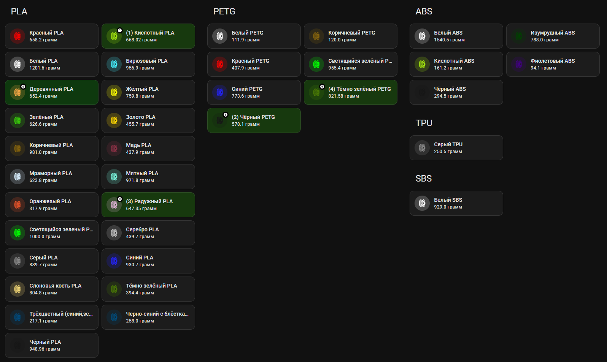
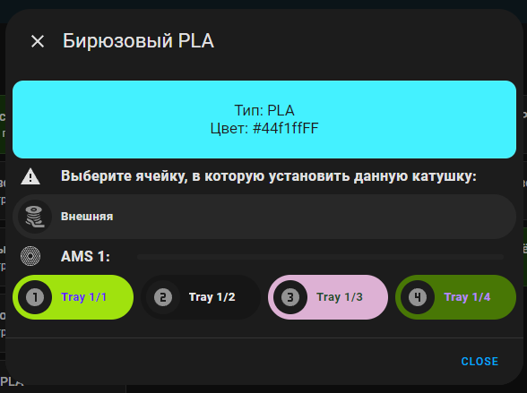

[](https://www.tinkoff.ru/rm/dontsov.sergey22/KEZ6r54259)

# Как это выглядит?



# Замена катушки без слайсера



# Установка
### ВНИМАНИЕ

Для данной доработки необходимо установить мой форк интеграции [ha-bambulab](https://github.com/Striker72rus/ha-bambulab) в ней доработана отправка команды на смену катушек.
Установить зависимые кастомные компоненты:
* [lovelace-mushroom](https://github.com/piitaya/lovelace-mushroom)
* [hass-browser_mod](https://github.com/thomasloven/hass-browser_mod)
* [lovelace-auto-entities](https://github.com/thomasloven/lovelace-auto-entities)
* [custom-brand-icons](https://github.com/elax46/custom-brand-icons)
* [button-card](https://github.com/custom-cards/button-card)
* [bubble-card](https://github.com/Clooos/Bubble-Card)

Создать скрипт через интерфейс
> Настройки > Автоматизации и сцены > Скрипты > Создать скрипт

```yaml
alias: Multi Tap Action
sequence:
  - repeat:
      for_each: "{{actions}}"
      sequence:
        service: "{{repeat.item.service}}"
        data: "{{repeat.item.data}}"
mode: parallel
description: Используется для смены катушек в Bambu lab принтерах
```

После установки, небходимо добавить интеграцию Browser mod в настройках. Далее добавляете новую кастомную карточку со следующим [содержимым](custom_card.yaml). Надеюсь смогу его оптимизировать в будущем.


Необходимо будет только поправить Title и две переменные:
```

Меняете Тип пластика, который необходим для отображения
```
```


model_serial_change_filament_spool_ams - заменяете на свой сервис, нужного принтера
```
Найти нужное имя сервиса можно тут:
Панель разработчика > Службы > Начните вводить "bambu_lab"

И увидите нужное название сервиса
